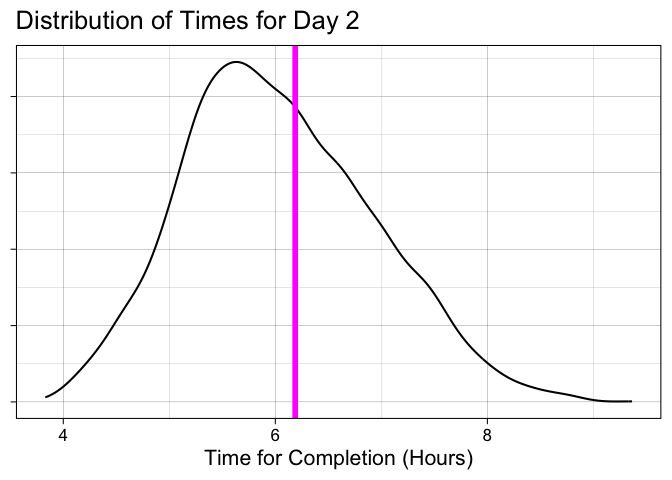

# Data Viz Final Project - ADK 90-Miler Shiny App

## Data

This repository is built on data related to the Adirondack Canoe Classic
(90-Miler) race from 2008-2025. Data is separated between days of the
three-day event. Race-specific finisher data is pulled from
[PaddleStats](https://paddlestats.net/racehistory/ADK90), water level
data comes from the [USGS](https://www.usgs.gov/), and weather data was
gathered using [Open-Meteo](https://open-meteo.com/). The important
variables (other than `year` which is used for organization) are `temp`,
`water` (level), `n_paddler` (# of paddlers), `boatType`, and `value`
(time).

## Questions

Throughout this project, I sought to see if weather and water level
measurements were useful for understanding time variations in the
90-Miler results from year-to-year. I wanted to build a model to predict
a boat’s time on each day of the race using those measures as well as
boat type and number of paddlers, and to make this model accessible to
non-coders.

## Results

I found that water level and temperature measurements were useful
predictors, especially when combined with boat type. I used these
variables—as well as number of paddlers—as part of a linear regression
model to predict future boats’ times for each day of the ADK. My next
step was to create a Shiny App that made this model approachable for
non-data-scientists.

## Static Example of Final Product

This graph is a static version of a plot that would result from a user
inputting the following values in the Shiny App: Day 2, `temp` = 52,
`level` = 3.2, `boatType` = Canoe, `n_paddler` = 2.

## More

To learn more about the 90-Miler, check out their
[website](http://www.90miler.org/).

To see more canoeing stats, check out
[PaddleStats](https://paddlestats.net/).

To see another predictive model like this, check out [Ryan Matthews’s
estimates](https://www.ausablecanoemarathon.org/stats-and-history/estimated-winning-time/)
for the winning times at the AuSable Canoe Marathon.
