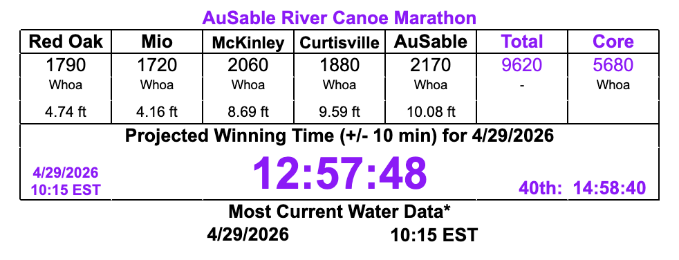

```{r}
#| output: FALSE
library(tidyverse)
day2 <- read_csv("day2_full.csv")
day2_smallest <- day2 |> group_by(year) |> mutate(time = median(value)) |> slice(1)

day2_type <- day2 |> filter(boatType != "Unknown") |>
  mutate(boatType = if_else(classId == "voyageur",
                            "Voyageur",
                            boatType))

mod_time <- lm(value ~ boatType + temp + water, day2_type)
summary(mod_time)

27260.19 - (39.32*57) - (679.29*4)
```


## Data Introduction

Data about the ADK 90-Miler from 2008-2025

- Results (times, boat types, etc.)
- Weather and water level data
  - collected over 3 days and locations
  - manually collected and compiled

## Question of Interest

Can I produce a helpful predictive model for future boats' times in the 90-Miler?
  
  - and, can I make this accessible to others?
  
I was inspired by Ryan Matthews who has created a model predicting times for the Ausable Canoe Marathon.



## Exploration: Water Level

I started by finding useful variables

```{r}
ggplot(day2_smallest, aes(y = time, x = water)) +
  geom_point() +
  geom_jitter(width = .1) +
  labs(x = "Water Level (ft)",
       y = "Time (sec)") +
  theme_linedraw(base_size = 24)
```

## Exploration: Boat Type

```{r}
ggplot(day2_type, aes(y = value, x = boatType, group = boatType)) +
  geom_boxplot() +
  labs(x = "Boat Type",
       y = "Time (sec)") +
  theme_linedraw(base_size = 24)
```

My end model will use water level, boat type, number of paddlers, and temperature to estimate a boat's time.

## The End Goal

I am working to create a shiny app that lets users choose:

- the day they are interested in
- the craft 
- *the number of paddlers* (this is somewhat complicated)
- the temperature
- the water level

And produces a prediction for that craft's time as well as a graph of the distribution of past times for the day with a line representing the prediction.

## Example

The prediction here is for a Canoe on a 57 degree day (day 2) and a water level of 4 ft.

```{r}
ggplot(day2_type, aes(x = value)) +
  geom_density() +
  geom_vline(xintercept = 22301.79, color = "magenta") +
  labs(x = "Time (sec)") +
  theme_linedraw(base_size = 24) +
  theme(axis.title.y = element_blank(), axis.text.y = element_blank())
```

## Thank you!


